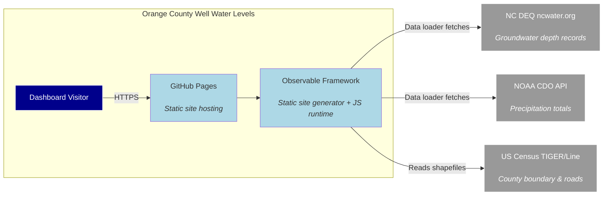

# Groundwater levels in Orange County, NC

A self-refreshing dashboard of Orange County, NC well groundwater levels, built on
**[Observable Framework](https://observablehq.com/framework)**. Framework *data
loaders* pull live data at build time, the charts use the libraries Framework ships
(Observable Plot / d3 + Vega-Lite), and a scheduled rebuild republishes fresh numbers —
no hand-edited data.

This dashboard is published at [Orange County Well Water Levels](https://dsummersl.github.io/orange-county-nc-wells/)

## Run it

Everything lives in this one directory (the Framework app at the root, Python helpers
in `scripts/`).

```bash
npm install                # once
npm run dev                # dev server at http://127.0.0.1:3000
```

`npm run dev` (and `npm run build`) run the data loaders in `src/data/`, which fetch
live data. For the precipitation layer, export a free NOAA token first:

```bash
export NOAA_CDO_TOKEN=…     # https://www.ncdc.noaa.gov/cdo-web/token
```

Build the static site to `dist/`:

```bash
npm run build
```

> Framework caches loader output under `src/.observablehq/cache`. If precip stays
> blank after you set `NOAA_CDO_TOKEN`, it cached the earlier "no token" result — run
> `npm run clean` and rebuild.

## Architecture context



## Tech stack

- **Runtime:** Node.js ≥18, Python ≥3.11
- **Framework:** [Observable Framework](https://observablehq.com/framework) (~1.13)
- **Charts:** [Observable Plot](https://observablehq.com/plot/) (d3-geo, Vega-Lite)
- **Data fetch:** Python (`requests`, `pandas`)
- **CI/CD:** GitHub Actions + GitHub Pages
- **Quality:** pytest, ruff, mypy, pre-commit

## External dependencies

| Dependency | Purpose | Access |
|---|---|---|
| [ncwater.org](https://www.ncwater.org) | Daily groundwater depth per well | Public web, no token needed |
| [NOAA CDO API](https://www.ncdc.noaa.gov/cdo-web/) | Monthly precipitation totals | Free token (`NOAA_CDO_TOKEN`) |
| [US Census TIGER/Line](https://www2.census.gov/geo/tiger/) | County boundary & road shapefiles | Public FTP |

## Links

- Published dashboard: <https://dsummersl.github.io/orange-county-nc-wells/>
- System architecture: [`docs/architecture.md`](docs/architecture.md)
- ADR-0001: [`docs/adr/0001-use-observable-framework.md`](docs/adr/0001-use-observable-framework.md)

## TODOs

- **Bedrock geology layer** — Replace the surface-water features (rivers) on the map
  with a subsurface geology layer (NCGS 1:500k bedrock map). Shallow wells tap
  saprolite/regolith while deep wells tap fractured bedrock; rock type (granite, schist,
  diabase) strongly influences well yield and water storage. A choropleth underlay would
  make the well-depth annotations more meaningful.
