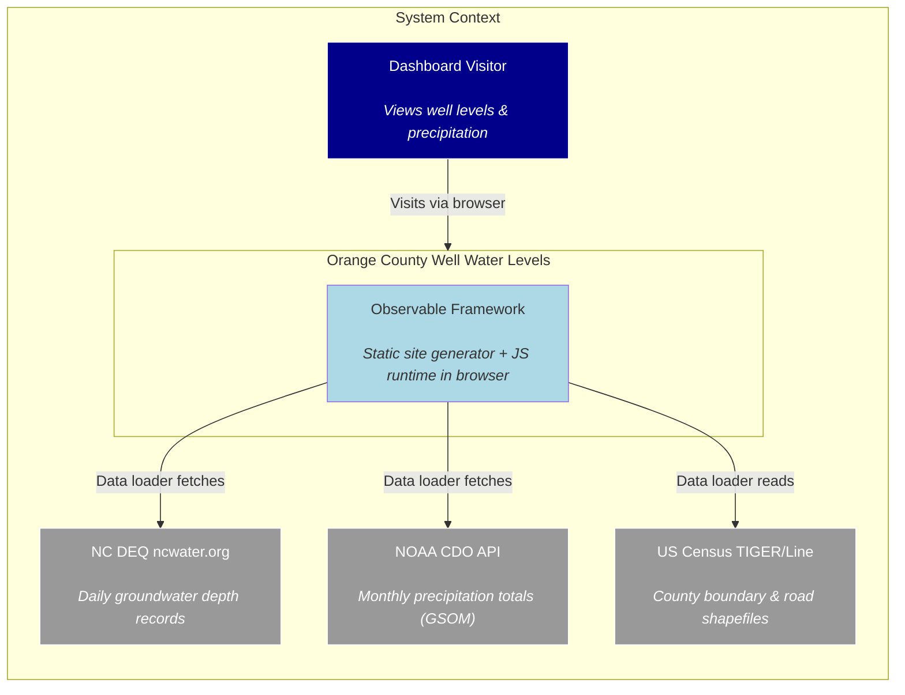
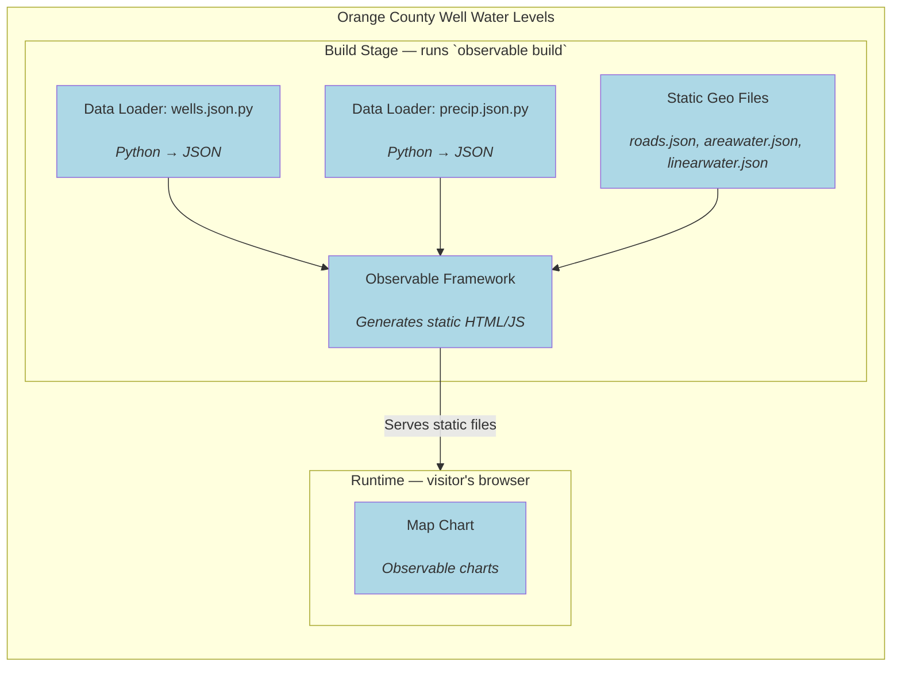
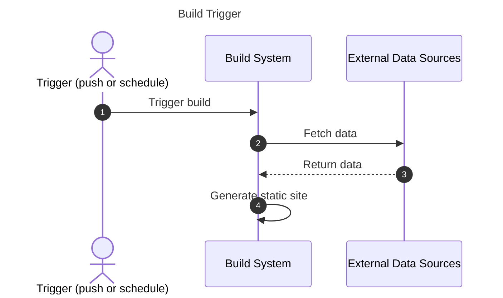
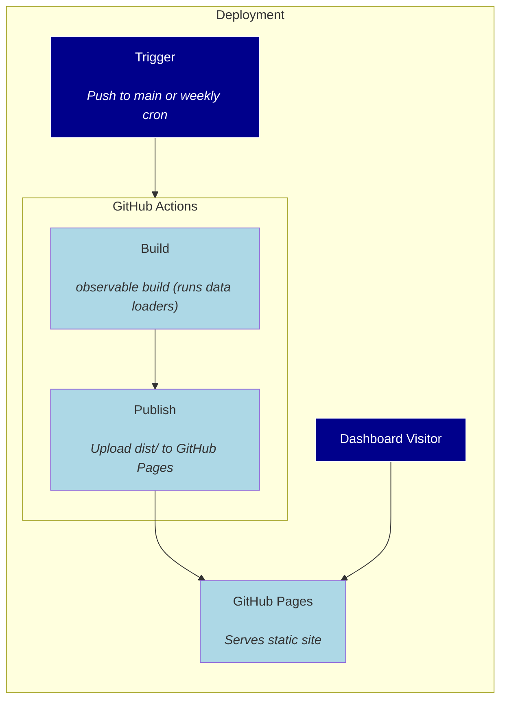

# Orange County Well Water Levels — Architecture

**Project:** Orange County Well Water Levels
**Status:** Active development — static dashboard serving live groundwater and precipitation data
**Last synced:** `619ec0f` (2026-07-22) — initial architecture document

# Introduction

A self-refreshing static dashboard of Orange County, NC groundwater well levels. Data loaders pull live groundwater records (ncwater.org) and monthly precipitation totals (NOAA CDO) at build time; charts render client-side with Observable Plot. A scheduled GitHub Action rebuilds weekly so the published site always shows fresh numbers without manual data handling.

## Quality Goals

1. **Freshness** — displayed data is never more than a week old without manual intervention.
2. **Zero operational cost** — fully static site on GitHub Pages; no servers, no databases, no API keys at runtime.

## Stakeholders

| Stakeholder | Expectation |
|---|---|
| Public visitor | See current groundwater trends for Orange County wells |
| Developer | Minimal maintenance; one-command dev setup; easy to add new wells or data layers |

# Constraints

- **Static site** — Observable Framework generates a flat HTML/JS/CSS output; no server-side processing at request time.
- **No browser at build time** — all data fetch uses `requests` (Python); no headless Chrome or JavaScript runtime during the build.
- **NOAA rate limits** — 5 requests/second; the NOAA data loader throttles to avoid 429 responses.

# Context

## System Context Diagram

## External Interfaces

| Interface | Direction | Protocol | Details |
|---|---|---|---|
| ncwater.org | Fetch | HTTPS (requests) | Token-scraped HTML pages + CSV downloads for each well |
| NOAA CDO API | Fetch | HTTPS (REST, token auth) | GSOM monthly dataset + GHCND daily for current partial month |
| US Census TIGER/Line | Fetch | HTTPS, ZIP downloads | County shapefile + roads shapefile; processed offline into JSON |
| GitHub Pages | Serve | HTTPS | Static site served from `dist/` |

# Solution Strategy

- **Observable Framework** chosen for its built-in data loader pipeline (Python scripts → JSON → reactive JS charts), zero-config builds, and native Observable Plot / d3 support.
- **Static pre-rendering** — all data is fetched at build time; the browser only runs chart rendering and interactivity (tooltips, well selection, map clicks).
- **Graceful degradation** — NOAA precipitation and Census shapefiles are optional; the dashboard shows helpful placeholder text when they are unavailable.
- **No JavaScript runtime at build time** — ncwater.org scraping uses Python `requests`

# Building Block View

# Runtime View

## Fetching Data

# Deployment View

## Environment

| Node | Technology | Purpose |
|---|---|---|
| Build | GitHub Actions (ubuntu-latest), Node 22, Python 3.12 | Runs Framework build + data loaders |
| Hosting | GitHub Pages | Serves static site |
| Source | GitHub (main branch) | Version control + trigger |

# Crosscutting Concepts

## Data Model

The entire runtime data model is three JSON blobs loaded via `FileAttachment`:

- **wells.json** — array of well objects with lat/lon/depth_class/delta_vs_baseline per month; county-aggregate series by year; metadata (generated timestamp, source)
- **precip.json** — monthly precipitation by year; climatology averages and stddevs (1991–2020); current-year monthly totals
- **basemap JSON files** — TopoJSON-like features for Orange County boundary, roads, area water, linear water (projected from TIGER/Line shapefiles)

There is no client-side database, no API, and no state beyond the hidden `<input>` tracking the selected well ID.

## Build Cache

Framework caches data loader output under `src/.observablehq/cache/`. If the NOAA token is added after a cached failure, the cache must be cleared (`npm run clean`) for the loader to re-run.

# Architectural Decisions

- [ADR-0001: Use Observable Framework for the Dashboard](adr/0001-use-observable-framework.md)

# Quality Requirements

## Quality Scenarios

| Scenario | Criterion |
|---|---|
| NOAA token expires | Dashboard still loads — precip section degrades gracefully, wells and map unaffected |
| ncwater.org changes HTML | Data loader fails — build fails — deploy skipped; developer notified by failed Action |
| New well added to Orange County network | Auto-discovered by the well-list scrape, no config change needed; metadata enrichment requires manual update to `wells_meta.json` |

# Risks

## Incomplete documentation

- [Glossary](https://docs.arc42.org/section-12/) — no glossary section exists; domain terms (e.g., "deficit", "climatology window", "regolith vs. bedrock well") are not formally defined.

